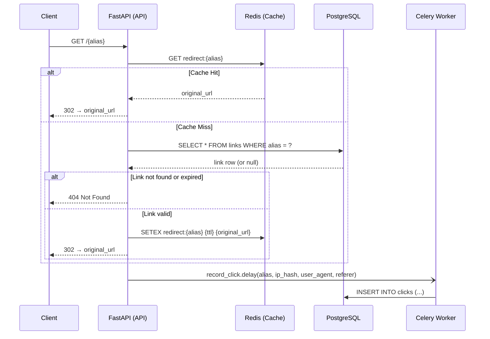
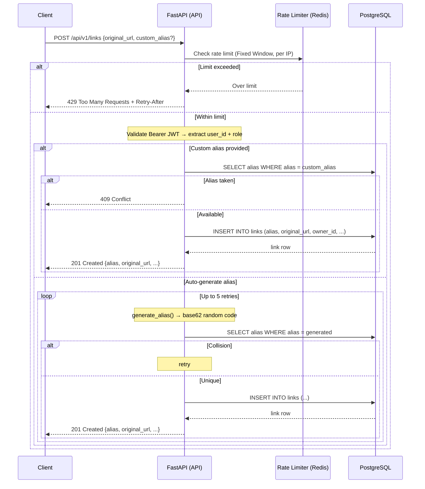

# Architecture

## Request Lifecycle — Redirect (Core Flow)



## Request Lifecycle — Create Short Link



## Data Model

```
users
├── id             PK
├── email          UNIQUE INDEX
├── hashed_password
├── role           ENUM (user | admin)
└── created_at

links
├── id             PK
├── alias          UNIQUE INDEX
├── original_url
├── owner_id       FK → users.id
├── expires_at     NULLABLE
├── created_at
└── updated_at

clicks
├── id             PK
├── link_id        FK → links.id
├── ip_hash        SHA-256(raw_ip) — not PII
├── user_agent
├── referer
└── clicked_at     INDEX

refresh_tokens
├── id             PK
├── jti            UNIQUE INDEX (JWT ID)
├── user_id        FK → users.id
├── expires_at
└── revoked        BOOLEAN
```

## Component Overview

```
┌─────────────────────────────────────────────────────────┐
│                        Client                           │
└───────────────────────┬─────────────────────────────────┘
                        │ HTTP
┌───────────────────────▼─────────────────────────────────┐
│                    FastAPI (uvicorn)                     │
│  ┌─────────────┐  ┌───────────┐  ┌────────────────────┐ │
│  │  Middleware  │  │  Routers  │  │  Exception Handler │ │
│  │ RequestID   │  │ /api/v1/* │  │  (uniform errors)  │ │
│  │ Rate Limit  │  │ /{alias}  │  └────────────────────┘ │
│  └─────────────┘  └─────┬─────┘                         │
│                         │                               │
│  ┌──────────────────────▼──────────────────────────┐    │
│  │              Services Layer                     │    │
│  │  auth · user · link · analytics                 │    │
│  └──────────┬──────────────────────────────────────┘    │
│             │                                           │
│  ┌──────────▼──────────────────────────────────────┐    │
│  │            Repositories Layer                   │    │
│  │  user_repo · link_repo · click_repo · token_repo│    │
│  └──────────┬──────────────────────────────────────┘    │
└─────────────┼───────────────────────────────────────────┘
              │
   ┌──────────┼──────────┐
   ▼          ▼          ▼
PostgreSQL  Redis     Celery Worker
(persistent) (cache/   (async click
             broker)    recording)
```

## Key Design Decisions

| Decision | Rationale |
|---|---|
| Always create new alias for duplicate URLs | Requirement: each POST creates a fresh link, regardless of original_url |
| Cache-aside pattern for redirects | Redis hit avoids DB query on the hottest path |
| Cache eviction on delete/update | Synchronous eviction prevents stale redirects |
| 404 (not 403) for other user's link | Prevents resource enumeration by bad actors |
| Uniform 401 on all auth failures | Prevents username/password oracle attacks |
| SHA-256(ip) stored, not raw IP | GDPR-friendly: pseudonymised click data |
| Redirect router registered last | Prevents `/{alias}` catch-all from shadowing `/api/v1/*` |
| Celery uses sync SQLAlchemy (psycopg2) | Celery workers are synchronous; asyncpg cannot be used |
